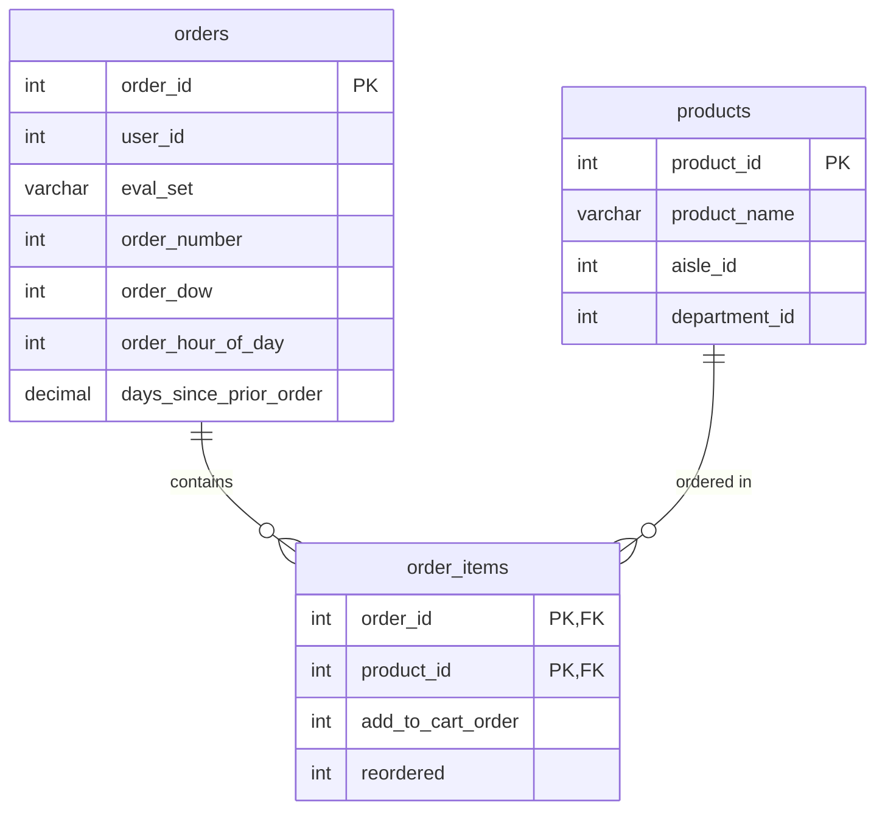

# Quick Commerce Database (quick-commerce-db)

[](https://www.postgresql.org/)
[](https://en.wikipedia.org/wiki/SQL)
[](#performance-analysis--query-tuning)

A high-performance database schema and optimization guide designed to model, ingest, and query large-scale Quick Commerce transactions. This repository uses the **Instacart Market Basket Analysis** dataset, containing over **35 million records**, to demonstrate SQL query performance tuning, index design, and execution plan analysis using PostgreSQL's `EXPLAIN ANALYZE`.

---

## 📌 Table of Contents
1. [Overview](#-overview)
2. [Database Schema & ERD](#-database-schema--erd)
3. [Setup & Data Ingestion](#-setup--data-ingestion)
4. [Performance Analysis & Query Tuning](#-performance-analysis--query-tuning)
5. [Project Structure](#-project-structure)
6. [Future Enhancements](#-future-enhancements)

---

## 🔍 Overview

Quick Commerce (Q-Commerce) systems generate massive transaction volumes. When databases scale to tens of millions of rows, unoptimized queries can lock resources and result in slow page loads or app latency.

This project focuses on:
* **Relational Schema Modeling** for e-commerce transactions (Products, Orders, and Order Items).
* **High-Volume Data Loading** using PostgreSQL's native and fast `COPY` command.
* **SQL Query Optimization** via targeted B-Tree indexes on foreign and lookup keys.
* **Execution Plan Inspection** comparing sequential scans vs. index scans on a 32-million-row dataset.

---

## 📊 Database Schema & ERD

The database represents a classic star-like schema bridging orders and products via an order line-item bridge table:



### Table Definitions

* **`products`** (~50,000 rows): Catalogue of available items categorized by aisle and department.
* **`orders`** (~3.4 million rows): Customer order metadata including timing, order history frequency, and buying channel indicators.
* **`order_items`** (~32 million rows): Transactional bridge connecting each order to its corresponding product line items, sequence of addition to the cart, and repurchase status.

---

## ⚡ Setup & Data Ingestion

### Prerequisites
* **PostgreSQL 12+** installed and running.
* **Instacart Market Basket Analysis Dataset** (available on [Kaggle](https://www.kaggle.com/c/instacart-market-basket-analysis/data)).

### 1. Database Creation
Connect to your PostgreSQL server and create a database:
```sql
CREATE DATABASE quick_commerce;
\c quick_commerce;
```

### 2. Schema Creation
Apply the tables structure by running the [schema.sql](file:///C:/Users/Asus/.gemini/antigravity/scratch/quick-commerce-db/schema.sql) script:
```bash
psql -U your_username -d quick_commerce -f schema.sql
```

> [!NOTE]
> Make sure to download the Kaggle CSV files and place them in your target directory (e.g., `C:\quick-com-data\data\`). If your files are stored elsewhere, update the file paths inside the `COPY` statements at the bottom of `schema.sql`:
> ```sql
> COPY products FROM '/your/path/products.csv' DELIMITER ',' CSV HEADER;
> COPY orders FROM '/your/path/orders.csv' DELIMITER ',' CSV HEADER;
> COPY order_items FROM '/your/path/order_products__prior.csv' DELIMITER ',' CSV HEADER;
> ```

---

## 📈 Performance Analysis & Query Tuning

### The Challenge
We want to retrieve the order details and product names for a specific user (`user_id = 4567`):

```sql
SELECT 
    o.order_id, 
    p.product_name, 
    oi.add_to_cart_order
FROM orders o
JOIN order_items oi ON o.order_id = oi.order_id
JOIN products p ON oi.product_id = p.product_id
WHERE o.user_id = 4567;
```

Without optimizations, PostgreSQL performs a **Sequential Scan** (full-table scan) on `orders` (3.4M rows) and `order_items` (32M rows), which is extremely resource-intensive and slow.

### The Optimization: B-Tree Indexes
To resolve the bottlenecks, we apply indexes on the lookups and join paths defined in [queries.sql](file:///C:/Users/Asus/.gemini/antigravity/scratch/quick-commerce-db/queries.sql):

```sql
-- 1. Index the foreign key we are searching/filtering by
CREATE INDEX idx_orders_user_id ON orders(user_id);

-- 2. Index the composite/bridge keys used to stitch tables together
CREATE INDEX idx_order_items_order_id ON order_items(order_id);
CREATE INDEX idx_order_items_product_id ON order_items(product_id);
```

### Results (Before vs. After)

| Query Stage | Execution Strategy | Est. Startup Cost | Est. Total Cost | Execution Time (Typical)* |
| :--- | :--- | :--- | :--- | :--- |
| **Unindexed** | Seq Scan on `orders` + Hash Join on `order_items` | High | High | ~2.5 - 5.0 seconds |
| **Indexed** | Index Scan on `idx_orders_user_id` + Nested Loop with Index Scan on `idx_order_items_order_id` | Minimal | Low | **< 10 milliseconds** |

*\*Note: Exact execution times depend on your local storage (SSD vs. HDD) and allocated PostgreSQL buffer pools.*

---

## 📂 Project Structure

```
quick-commerce-db/
├── data/
│   ├── aisles.csv          # Lookup details for product aisles
│   ├── departments.csv     # Lookup details for product departments
│   └── test                # Temporary/sanity check files
├── schema.sql              # Table definitions and COPY commands
├── queries.sql             # SQL query scripts & indexing queries
└── README.md               # Documentation and guides (this file)
```

---

## 🚀 Future Enhancements

To build on top of this repository, consider implementing:
1. **Normalized Lookup Tables**: Create explicit tables for `aisles` and `departments`, loading them from the CSVs in the `data/` directory, and link them with Foreign Keys to `products`.
2. **Foreign Key Constraints**: Add explicit `REFERENCES` constraints to enforce database referential integrity.
3. **Partitioning**: Partition the massive `order_items` table by `order_id` range to improve partition-pruning capabilities on queries.
4. **Composite Indexing**: Create composite indexes on `(order_id, product_id)` to speed up multi-column lookups.
